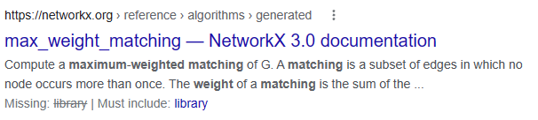

# Matchmaker
Reading the challenge description, it seems very simple: all you have to do is find the pairs that sum to the maximum number. Doing a slight bit of googling, we can see that what we want is called a "maximum weighted matching". Surely there's an implementation of this online... <br><br>

<br><br>
Oh look, there's one. Now the rest is pretty straightforwards, all that needs to be done is to handle the input and output. After some coding and a lot of time spent trying to figure out why it isn't working (pro tip: don't send multiple newlines), the final code is below:
```py
import networkx as nx
from pwn import *
io = remote("0.cloud.chals.io", 22304)
for aaaa in range(3):
  print(aaaa)
  G = nx.Graph()
  a = list(map(int, io.recvline().strip().decode().split()))
  numpeople = len(a)+1
  G.add_nodes_from(range(0, numpeople))
  for i in range(numpeople):
    for j in range(i):
      G.add_edge(i, j, weight=0)
  for i in range(len(a)):
    G[0][i+1]['weight'] += a[i]
  for i in range(len(a)):
    b = list(map(int, io.recvline().strip().decode().split()))
    for j in range(len(a)+1):
      if j < i+1:
        G[j][i+1]['weight'] += b[j]
      elif j > i+1:
        G[i+1][j]['weight'] += b[j-1]
  c = sorted(nx.max_weight_matching(G))
  output = ""
  listpeoples = []
  for i in range(len(c)):
    listpeoples.append(list(c[i]))
    asdfasdf = list(c[i])
    asdfasdf.reverse()
    listpeoples.append(asdfasdf)
  listpeoples.sort()
  for i in range(len(listpeoples)):
    if i == len(listpeoples)-1:
      output += str(listpeoples[i][0]) + "," + str(listpeoples[i][1])
    else:
      output += str(listpeoples[i][0]) + "," + str(listpeoples[i][1]) + ";"
  print(output)
  print(len(listpeoples))
  io.sendlineafter(b">", output.encode())
while True:
  print(io.recv())
```
This outputs the flag, which is `valentine{l0V3_i5_1n_7he_4ir}`.
